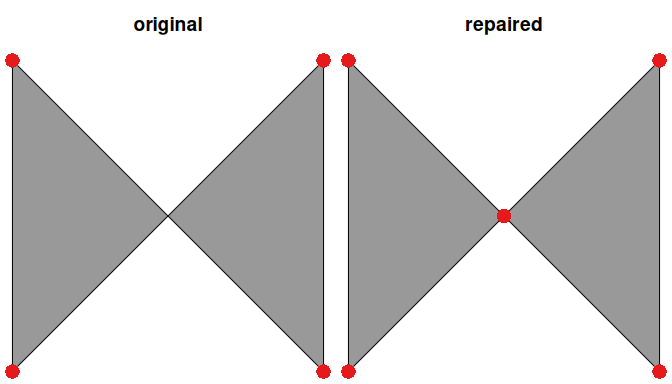

<!-- README.md is generated from README.Rmd. Please edit that file -->

# prepr 

## Automatic Repair of Spatial Polygons

<!-- badges: start -->

[](https://lifecycle.r-lib.org/articles/stages.html)
[](https://github.com/prioritizr/prepr/actions)
[](https://github.com/prioritizr/prepr/actions)
[](https://github.com/prioritizr/prepr/actions)
[](https://app.codecov.io/gh/prioritizr/prepr/branch/master)
[](https://CRAN.R-project.org/package=prepr)
<!-- badges: end -->

### Overview

The *prepr R* R package is used to repair broken spatial polygons. To
achieve this, the package uses the constrained triangulation approach
implemented in the [`prepair`](https://github.com/tudelft3d/prepair) C++
library ([Ledoux et
al. 2014](https://doi.org/10.1016/j.cageo.2014.01.009)). Specifically,
the `st_prepair()` function is used to repair polygons. For more
information, please see the package vignette.

### Installation

The latest version can be installed from the [online source code
repository](https://github.com/prioritizr/prepr) using the following *R*
code.

``` r
if (!require(remotes)) install.packages("remotes")
remotes::install_github("prioritizr/prepr")
```

#### Windows

The [Rtools](https://cran.r-project.org/bin/windows/Rtools/) software
needs to be installed to install the *prepr R* package from source. This
software provides system requirements from
[rwinlib](https://github.com/rwinlib/).

#### Ubuntu

The `gmp`, `mpfr`, and `gdal` libraries need to be installed to install
the *prepr R* package. For recent versions of Ubuntu (18.04 and later),
these libraries are available through official repositories. They can be
installed using the following system commands:

    sudo add-apt-repository ppa:ubuntugis/ubuntugis-unstable
    sudo apt-get -y update
    sudo apt-get install \
      libudunits2-dev libgdal-dev libgeos-dev libproj-dev \
      libsqlite0-dev libgmp3-dev libmpfr-dev

#### Linux

For Unix-alikes, `gmp` (&gt;= 4.2.3), `mpfr` (&gt;= 3.0.0), and `gdal`
(&gt;= 2.0.1) are required.

#### macOS

The `pkg-config`, `gmp`, `mpfr`, and `gdal` libraries are required. The
easiest way to install these libraries is using
[HomeBrew](https://brew.sh/). After installing HomeBrew, these libraries
can be installed using the following commands in the system terminal:

    brew install pkg-config
    brew install gmp
    brew install mpfr
    brew install gdal

### Citation

We recommend citing the methodology that underpins the *prepr R*
package. To cite this work, please use:

> Ledoux H, Arroyo Ohori K, and Meijers M (2014) A triangulation-based
> approach to automatically repair GIS polygons. *Computers &
> Geosciences* 66:121–131.

### Usage

Here we provide a short example showing how the *prepr* package can be
used to repair broken polygon geometries. To start with, we will load
the package. We will also load the *sf* package for working with spatial
data.

``` r
# load packages
library(sf)    # package for working with spatial data
library(prepr) # package for repairing spatial geometries
```

Next, we will create a broken spatial polygon.

``` r
# create broken polygon
x <- st_as_sfc("POLYGON((0 0, 0 10, 10 0, 10 10, 0 0))")

# verify that polygon is broken, and display reason why it's broken
st_is_valid(x, reason = TRUE)
```

    ## [1] "Self-intersection[5 5]"

Now we will use the `st_prepair()` function to repair the broken
polygon.

``` r
# repair the polygon
y <- st_prepair(x)

# verify that repaired polygon is NOT broken
st_is_valid(y)
```

    ## [1] TRUE

Finally, we can compare the two polygons. To achieve this, let’s plot
both the two polygons (shown in gray) and also plot the vertices for the
two polygons (shown in red).

``` r
# visualize the polygons
par(mfrow = c(1, 2), mar = c(0, 0, 2.5, 0))
plot(x, main = "original", col = "#999999")
points(st_coordinates(st_cast(x, "POINT")), col = "#e41a1c", pch = 16, cex = 2)
plot(y, main = "repaired", col = "#999999")
points(st_coordinates(st_cast(y, "POINT")), col = "#e41a1c", pch = 16, cex = 2)
```



Although we can see that both of the polygons (shown in gray) appear
visually identical, the repaired polygon (`y`) has an additional vertex
(red point) in the center of the ‘bowtie’. This extra vertex is
important to maintain the validity fo the spatial polygon. For more
information and additional examples, see the [package
vignette](https://prioritizr.github.io/prepr/articles/prepr.html).

### Getting help

If you have any questions about using the *prepr R* package or
suggestions for improving it, please [file an issue at the package’s
online code repository](https://github.com/prioritizr/prepr/issues/new).
